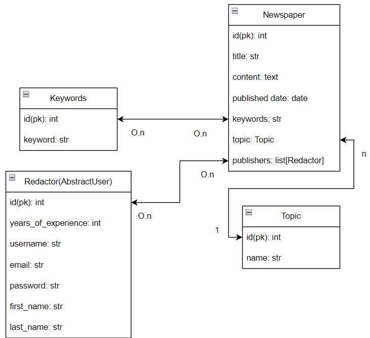

# News Service

This is a custom News service that allows creating articles, managing user accounts, and performing keyword-based searches for news articles. Users can publish news, sign up, log in, and delete their accounts. Each news article can be tagged with keywords for easier search.

## Deployed Project

You can see the deployed project by the link below:

[Deployed News Service](https://your-deployed-news-link.com)

Use the following credentials to log in:

- **Username:** test
- **Password:** passme12__

## Getting Started

### 1. Clone the Repository

```bash
git clone https://github.com/Maksym-Turenko/Newspaper-agency
cd news
```
### 2. Create and Activate Virtual Environment
For Unix system
```bash
python3 -m venv venv
source venv/bin/activate
```
For Windows
```bash
python -m venv venv
venv\Scripts\activate
```
### 3. Install Requirements
```bash
pip install -r requirements.txt
```
### 4. Apply Migrations
```bash
python manage.py makemigrations
python manage.py migrate
```
### 5. (Optional) Load Fixture Data
```bash
python manage.py loaddata data.json
```
### 6. Create a Superuser and Run the Server
```bash
python manage.py createsuperuser
python manage.py runserver  # http://127.0.0.1:8000/
```
## Project structure
```plaintext
Project
├── newspaper_agency
│    ├── __init__.py
│    ├── asgi.py
│    ├── settings.py
│    ├── urls.py
│    └── wsgi.py
│
├── news
│    ├── migrations
│    └── tests
│          ├── __init__.py
│          ├── test_admin.py
│          ├── test_forms.py
│          ├── test_models.py
│          └── test_views.py
│    ├── __init__.py
│    ├── admin.py
│    ├── apps.py
│    ├── forms.py
│    ├── models.py
│    ├── urls.py
│    └── views.py
│
├── manage.py
├── static
└── requirements.txt
```
## Features
* User Management: Create, log in, and delete user accounts.
* News Creation: Publish news articles with the ability to tag them with keywords.
* Keyword Search: Search news articles using associated keywords.

